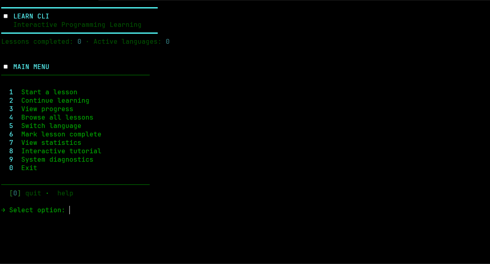

# LEARN: Programming in 20 Languages



[](https://opensource.org/licenses/MIT)
[](https://github.com/EanHD/learn)
[](https://github.com/EanHD/learn/blob/main/.devcontainer/devcontainer.json)
[](https://neovim.io)
[](https://github.com/EanHD/learn#-what-youll-learn)
[](https://github.com/EanHD/learn#-what-youll-learn)

**490 hands-on lessons.** Twenty languages. Five stages. Real projects.

Start coding in **5 minutes** with our **professional IDE setup** on Linux, macOS, and Windows.

---

## ✨ What's New (2025)

- 🎨 **Nightfox Theme** - Beautiful dark theme with excellent syntax highlighting
- 📖 **Smart Markdown Rendering** - Lessons display beautifully with icons and formatting
- 🔒 **Protected Lessons** - Read-only lesson files prevent accidental edits
- 📍 **Auto-Positioning** - Cursor starts at line 4, ready to code
- 🎯 **Enhanced Which-Key** - Clean, organized command menu
- ⚡ **19 Neovim Plugins** - LSP, Telescope, Flash navigation, and more
- 💬 **Help Comments** - Every code file starts with quick help reference
- 🪟 **Smart Window Navigation** - Seamless switching between lesson and code
- 🖥️ **Cross-Platform** - Works perfectly on Linux, macOS, and Windows
- 💻 **VS Code Support** - Vim motions, split-screen, and all features on VS Code

---

## 🚀 Quick Start

> **New to the platform?** Check out **[📖 START_HERE.md](START_HERE.md)** for a complete beginner's guide!

<!-- TODO: Add 10-second demo GIF showing:
     - Terminal launching `learn`
     - Interactive menu navigation
     - Lesson opening in split view (lesson left, code right)
     - Neovim with syntax highlighting and which-key popup
     Record with: asciinema + agg, or terminalizer
     Dimensions: 1200x600px for GitHub README -->

### One-line install (Linux/Mac)

```bash
bash <(curl -fsSL https://raw.githubusercontent.com/EanHD/learn/main/install.sh)
```

### Windows (PowerShell)

```powershell
irm https://raw.githubusercontent.com/EanHD/learn/main/install.ps1 | iex
```

This installs everything: CLI, Neovim config, and all dependencies.

### Update anytime

**Linux/Mac:**
```bash
bash ~/LEARN/install.sh --update
```

**Windows:**
```powershell
powershell -File ~\LEARN\install.ps1 -Update
```

### Launch

```bash
learn
```

This opens an **interactive menu** where you can browse lessons, track progress, and start learning immediately.

### Or jump straight to a lesson

```bash
learn open c++ 1 1         # C++ Stage 1, Level 1
learn open rust 1 1        # Rust Stage 1, Level 1
learn open python 1 1      # Python Stage 1, Level 1
```

### Choose your editor

```bash
learn open c++ 1 1 --vim       # Neovim (default, enhanced IDE)
learn open c++ 1 1 --vscode    # VS Code
learn open c++ 1 1 --terminal  # Terminal (read-only)
```

---

## 📚 What You'll Learn

| Stage | What It Is | Time |
|-------|-----------|------|
| **1** | Copy working code, learn syntax | Week 1 |
| **2** | Turn pseudocode into real code | Week 2 |
| **3** | Design solutions to small problems | Week 3 |
| **4** | Build full projects from scratch | Weeks 4-5 |
| **5** | Create your own capstone project | Week 6 |

**20 languages supported:**

- **Core:** C/C++, Rust, Go, Zig
- **Web & Scripting:** JavaScript, TypeScript, Python, PHP
- **Mobile:** Dart, Swift, Kotlin
- **Data & Databases:** SQL, NoSQL, R, Julia
- **Scripting:** Shell, PowerShell, Lua
- **Enterprise:** Java, C#

**7 lessons per stage** × **5 stages** = **35 lessons per language**

**Total: 490 lessons** across all 20 languages

---

## 🎮 How to Navigate

### Interactive Menu (Recommended)

```bash
learn
```

Browse all lessons, track progress, and jump between languages.

### Jump to a Lesson

```bash
learn open c++ 1 1       # Open C++ Stage 1, Level 1
learn open python 1 1    # Open Python Stage 1, Level 1
learn open java 1 1      # Open Java Stage 1, Level 1
learn open php 1 1       # Try PHP
learn open r 1 1         # Try R for data science
learn open zig 1 1       # Try Zig
```

### Browse by Category ⭐ NEW

```bash
learn browse             # Explore all language categories
learn browse --category web    # Jump to web languages
```

### Get Inspired ⭐ NEW

```bash
learn tip                # Random programming wisdom
```

### View All Lessons

```bash
learn list
```

See all 490 lessons organized by language and stage.

### Check Progress

```bash
learn progress
```

View completion stats and track your learning journey.

### Continue Learning

```bash
learn next
```

Automatically open the next lesson based on your progress.

### Get Help

```bash
learn --help
```

Show all available commands and options.

---

## � CLI Commands Reference

> **New!** The CLI now supports modern subcommands for better discoverability.

### 🎯 Core Commands

**Interactive Menu (Default)**
```bash
learn
```
Launch the full interactive menu to browse all lessons.

**Browse by Category** ⭐ NEW
```bash
learn browse               # Browse languages by category (core, web, mobile, data, scripting, enterprise)
learn browse --category web    # Jump to web languages
learn browse --guided      # Get extra tips and context
```

**Get Learning Tips** ⭐ NEW
```bash
learn tip                  # Random programming tip or fact
```

**Open a Lesson**
```bash
learn open python 1 1      # Python Stage 1, Level 1 (default editor)
learn open rust 2 3        # Rust Stage 2, Level 3
learn open cpp 1 1 --vim   # Force Neovim mode
learn open js 1 1 --vscode # Open in VS Code
learn open go 1 1 --terminal # Read-only terminal view
```

**List Lessons**
```bash
learn list                 # Show all 490 lessons
learn list --language python  # Filter by language
learn list --stage 2       # Filter by stage
```

**Track Progress**
```bash
learn progress             # View your learning stats
learn progress --language rust  # Progress in specific language
learn progress --export progress.json  # Export to file
learn progress --reset     # Reset all progress (requires confirmation)
```

**Next Lesson**
```bash
learn next                 # Get next recommended lesson
learn next --language python  # Next lesson in specific language
```

**Run Code**
```bash
learn run python 1 1       # Compile and run Python Stage 1, Level 1
learn run cpp 1 1          # Compile and run C++ code
learn run rust 2 3         # Compile and run Rust code
```

**Mark Complete**
```bash
learn complete python 1 1  # Mark Python S1L1 as done
learn complete rust 2 3    # Mark Rust S2L3 as done
```

### 🏥 System Commands

**Check Dependencies**
```bash
learn doctor               # Check all compilers and tools
```

**First-Time Setup**
```bash
learn init                 # Run setup wizard
```

**Configuration**
```bash
learn config --show        # View current settings
learn config --editor vim  # Set default editor
learn config --language python  # Set default language
learn config --reset       # Reset to defaults
```

### 📖 Legacy Syntax (Still Supported)

The old positional syntax still works for backward compatibility:

```bash
learn python 1             # Same as: learn open python 1 1
learn --list               # Same as: learn list
learn --progress           # Same as: learn progress
learn --next               # Same as: learn next
```

### 🆘 Get Help

```bash
learn --help               # Show all commands
learn open --help          # Help for specific command
learn browse --help        # Help for browse command
```

---

## �🛠️ Neovim IDE Features

When you open a lesson with Neovim (`learn open cpp 1`), you get:

### 🎨 Beautiful Interface
- **Nightfox theme** - Professional dark theme
- **Lualine statusbar** - Shows file, mode, git status
- **Render-markdown** - Lessons display with icons (📌 📍 🔸 ⬜ ✅)
- **Anti-conceal** - See raw markdown on cursor line

### 🔍 Smart Navigation
- **Flash.nvim** - Jump anywhere instantly with \`s\`
- **Telescope** - Fuzzy find files with \`<Space>ff\`
- **Which-Key** - Press \`<Space>\` to see all commands
- **Auto-save** - Code saves when switching windows

### 💻 Code Intelligence
- **LSP Support** - 7 language servers auto-installed
- **Treesitter** - Advanced syntax highlighting
- **Mason** - Automatic LSP management
- **Code actions** - Quick fixes with \`<Space>ca\`

### 🪟 Workflow
- **Split screen** - Lesson on left, code on right
- **Terminal** - Toggle with \`<Space>t\`
- **Zen mode** - Distraction-free with \`<Space>xz\`
- **Window navigation** - \`Ctrl+h/l\` or \`<Space>←→\`

### 🔒 Lesson Protection
- **Read-only lessons** - Can't accidentally edit
- **Help comments** - Every code file starts with: \`// Press <Esc> <Space> h for help.\`
- **Auto-positioning** - Cursor starts on line 4, ready to code
- **Flash navigation** - \`s\` key works in lessons for quick jumps

### ⚡ Key Bindings

**Leader key commands (press Space first):**

| Key | Action |
|-----|--------|
| \`<Space>g\` | Quick Guide popup |
| \`<Space>h\` | Essential Shortcuts popup |
| \`<Space>r\` | Run/Compile current file |
| \`<Space>t\` | Toggle terminal |
| \`<Space>w\` | Save file |
| \`<Space>n\` | Next lesson |
| \`<Space>p\` | Previous lesson |
| \`<Space>i\` | Show lesson info |
| \`<Space>ff\` | Find files (Telescope) |
| \`<Space>fg\` | Live grep search |
| \`<Space>fb\` | Browse buffers |
| \`<Space>fh\` | Help tags |
| \`<Space>ca\` | Code actions (LSP) |
| \`<Space>xx\` | Show diagnostics (Trouble) |
| \`<Space>xz\` | Toggle Zen mode |
| \`<Space>=\` | Equalize windows |
| \`<Space>.\` | Make window wider |
| \`<Space>,\` | Make window narrower |

**Always available:**

| Key | Action |
|-----|--------|
| \`Ctrl+h\` | Move to left window |
| \`Ctrl+j\` | Move to bottom window |
| \`Ctrl+k\` | Move to top window |
| \`Ctrl+l\` | Move to right window |
| \`Ctrl+d\` | Scroll down (centered) |
| \`Ctrl+u\` | Scroll up (centered) |
| \`s\` | Flash jump (even in lessons!) |
| \`S\` | Flash treesitter selection |
| \`gcc\` | Comment toggle current line |
| \`gc\` | Comment toggle linewise |
| \`K\` | Hover docs (LSP) |
| \`gd\` | Go to definition (LSP) |
| \`gr\` | Find references (LSP) |
| \`Esc\` | Clear search highlight / Exit terminal mode |

---

## 🎯 Three Ways to Use This

### 1️⃣ I'm Learning to Code

1. Install: \`bash <(curl -fsSL https://raw.githubusercontent.com/EanHD/learn/main/install.sh)\`
2. Start: \`learn\` (interactive mode)
3. Browse categories: \`learn browse\`
4. Select a language and lesson
5. Read the lesson (left pane) and write code (right pane)
6. Press \`<Space>h\` anytime for help
7. Mark complete: \`learn complete <lang> 1 1\`
8. Continue: \`learn next\`
9. Track progress: \`learn progress\`

### 2️⃣ I'm Learning a New Language

1. Browse categories: \`learn browse\`
2. Pick from 20 languages
3. Start: \`learn open python 1 1\` (or use interactive mode)
4. Each file starts with help comment
5. Press \`<Space>g\` for navigation guide
6. Lessons get progressively harder (Stage 1 → Stage 5)
7. Learn multiple languages to spot patterns!

### 3️⃣ I'm Teaching Others

All 490 lessons are organized by language:
\`c-c++/\`, \`rust/\`, \`python/\`, \`javascript/\`, \`typescript/\`, \`go/\`, \`lua/\`,
\`dart/\`, \`swift/\`, \`kotlin/\`, \`sql/\`, \`csharp/\`, \`shell/\`, \`powershell/\`,
\`java/\`, \`php/\`, \`r/\`, \`julia/\`, \`zig/\`, \`nosql/\`

Each lesson includes:

- Clear learning objectives
- Step-by-step instructions
- Language-specific code examples
- Success checklists
- Additional explanations
- Progressive difficulty

Students can track their own progress with the built-in progress system!

---

## 📖 Documentation

| File | Description |
|------|-------------|
| [FEATURES.md](FEATURES.md) | Complete feature list |
| [MODE_VIM/README.md](MODE_VIM/README.md) | Neovim setup and keybindings |
| [CLI/README.md](CLI/README.md) | CLI commands and usage |
| [VIM_CHEATSHEET.md](VIM_CHEATSHEET.md) | Quick Vim reference |
| [CONTRIBUTING.md](CONTRIBUTING.md) | How to contribute |

---

## 🆘 Need Help?

### Platform Support

| Platform | Status | Installer |
|----------|--------|-----------|
| 🐧 **Linux** | ✅ Fully Supported | \`install.sh\` |
| 🍎 **macOS** | ✅ Fully Supported | \`install.sh\` |
| 🪟 **Windows** | ✅ Fully Supported | \`install.ps1\` |

**All platforms include:** One-shot install, auto-update, CLI, and full Neovim IDE.

### Common Issues

| Problem | Solution |
|---------|----------|
| Command not found | Linux/Mac: \`bash install.sh\` • Windows: Run \`install.ps1\` |
| Need to update | Linux/Mac: \`bash ~/LEARN/install.sh --update\` |
|  | Windows: \`powershell -File ~\LEARN\install.ps1 -Update\` |
| Neovim issues | See: [MODE_VIM/README.md](MODE_VIM/README.md) |
| CLI help | Run: \`learn --help\` |
| Vim basics | Read: [VIM_CHEATSHEET.md](VIM_CHEATSHEET.md) |

### Feature Questions

**"Which-key menu is cluttered"**
- It's been cleaned up! Only essential commands show now

**"Lesson formatting disappears on cursor line"**
- Fixed! Anti-conceal keeps formatting visible

**"Help comment missing in code files"**
- Fixed! All new and existing empty files get help comments

**"Can't remember keybindings"**
- Press \`<Space>\` and wait - which-key shows everything
- Press \`<Space>h\` for essential shortcuts popup
- Press \`<Space>g\` for quick navigation guide

**"Can I use this on Windows?"**
- Yes! Full Windows support via PowerShell installer
- Same features as Linux/Mac

---

## 💡 Tips

- **Use interactive mode** (\`learn\`) for the best experience
- **Browse by category** (\`learn browse\`) to explore languages
- **Get inspired** with \`learn tip\` for programming wisdom
- **Start with Python or C++** if you're new (most forgiving)
- **Try Rust or Go** for systems programming
- **JavaScript/TypeScript for web**, **Dart for mobile**
- **Shell for DevOps**, **SQL for databases**
- **Kotlin for Android**, **Swift for iOS**
- **Press \`<Space>h\` in Neovim** for instant help
- **Track progress** with \`learn progress\`
- **Learn multiple languages** to see programming patterns

---

## 🚀 What's Next?

```bash
learn
```

Launch the interactive menu and start your learning journey!

Or browse and jump straight in:

```bash
learn browse         # Explore categories
learn open c++ 1 1   # C++
learn open python 1 1    # Python
learn open typescript 1 1    # TypeScript
learn open kotlin 1 1    # Kotlin
learn open sql 1 1       # SQL
```

Everything you need is built into the CLI and IDE.

---

## 📜 License

MIT License - See [LICENSE](LICENSE) for details

## 🤝 Contributing

Contributions welcome! See [CONTRIBUTING.md](CONTRIBUTING.md)

## 🌟 Star This Repo!

If you find LEARN helpful, please star it on GitHub!

---

**Happy Learning! 🎓**
